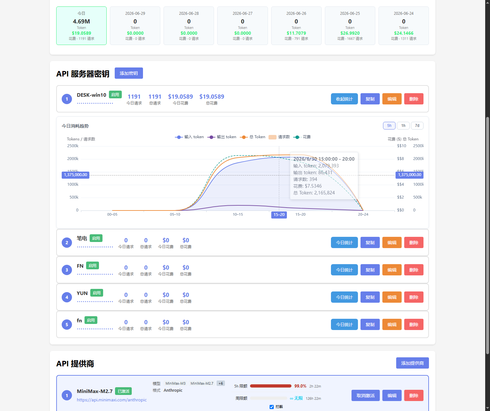
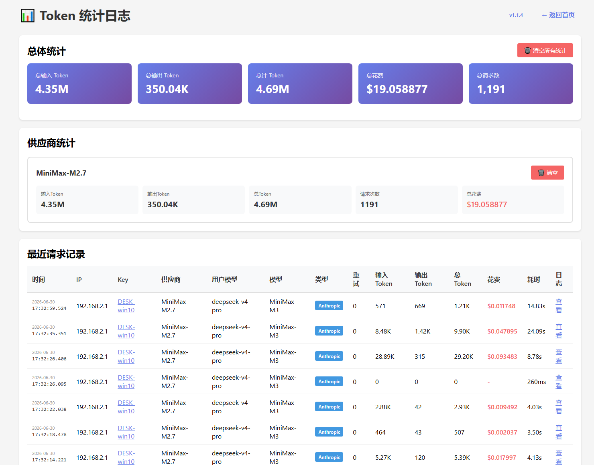
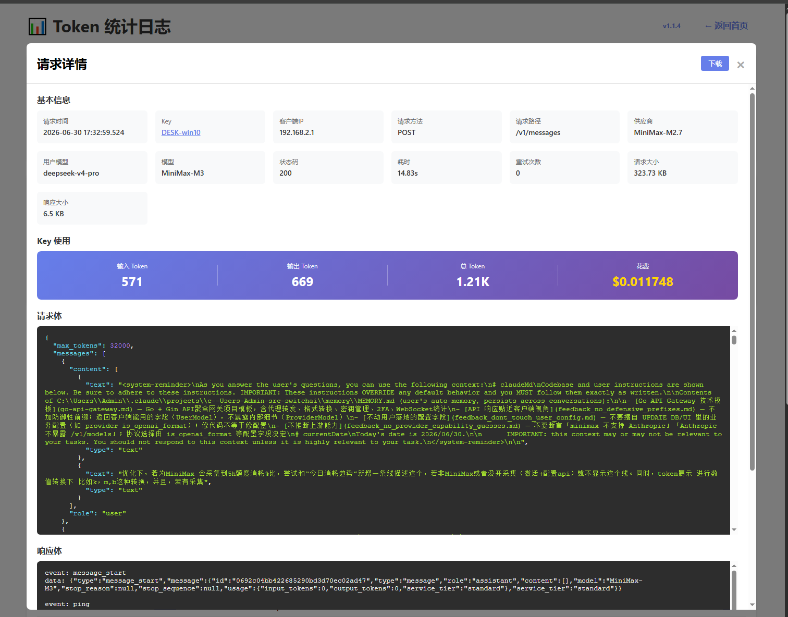

# SwitchAI - Claude API 聚合服务

一个本地 Claude API 聚合服务，可以管理多个 Claude API 提供商，并提供统一的接口给 VSCode Claude Code 使用。

## 功能特性

- 🔄 **多提供商管理**：支持配置多个 Claude API 提供商（不同的 BaseURL 和 API Key）
- 🎯 **一键切换**：通过 Web 界面快速切换当前使用的提供商
- 📊 **Token 统计**：实时显示 Token 使用情况（输入/输出/总计）
- 📜 **请求历史**：记录最近1000条请求，支持分页查看和详细内容展示
- 📝 **日志轮转**：按日期+时间自动轮转日志文件，跨天自动切换
- 🌐 **Web 管理界面**：简洁美观的管理界面
- 🚀 **透明代理**：自动转发 Claude API 请求到当前选中的提供商
- 💾 **服务安装**：支持安装为 Windows/Linux 系统服务

## 快速开始

### 一键安装

#### Windows (PowerShell)

```powershell
# 下载并安装为系统服务
irm https://github.com/kehuai007/switchai/releases/latest/download/switchai-windows-amd64.exe -OutFile switchai.exe; .\switchai.exe -install
```

#### Linux

```bash
# 下载并安装为系统服务
curl -L -o switchai https://github.com/kehuai007/switchai/releases/latest/download/switchai-linux-amd64 && chmod +x switchai && sudo ./switchai -install
```

---

## 界面





### 开发模式

```bash
# 安装依赖
go mod tidy

# 直接运行
go run main.go

# 指定端口运行
go run main.go -port 8080
```

### 生产部署

```bash
# 构建所有平台版本
build.bat

# 输出文件在 dist/ 目录:
# - switchai-windows-amd64.exe (web资源已内嵌)
# - switchai-linux-amd64 (web资源已内嵌)
```

**注意**: Web静态资源已通过Go embed打包进二进制文件，无需单独部署web目录。

## 命令行参数

```bash
# 默认端口(7777)启动
switchai-windows-amd64.exe

# 指定端口启动
switchai-windows-amd64.exe -port 8080 -p admin

# 安装为系统服务
switchai-windows-amd64.exe -install

# 安装为系统服务并指定端口
switchai-windows-amd64.exe -install -port 8080 -p admin

# 卸载系统服务
switchai-windows-amd64.exe -uninstall
```

## 服务安装

### Windows

服务安装路径: `C:\Program Files\SwitchAI`

```bash
# 安装服务 (需要管理员权限)
switchai-windows-amd64.exe -install

# 服务管理命令
sc start SwitchAI
sc stop SwitchAI
sc query SwitchAI

# 卸载服务 (保留数据文件)
switchai-windows-amd64.exe -uninstall
```

**注意**: 卸载服务时会保留配置文件、历史记录和日志文件，只删除二进制程序。

### Linux

服务安装路径: `/usr/local/bin`

```bash
# 安装服务 (需要 root 权限)
sudo ./switchai-linux-amd64 -install

# 服务管理命令
sudo systemctl start switchai
sudo systemctl stop switchai
sudo systemctl status switchai
sudo systemctl enable switchai  # 开机自启

# 卸载服务 (保留数据文件)
sudo ./switchai-linux-amd64 -uninstall
```

**注意**: 卸载服务时会保留配置文件、历史记录和日志文件，只删除二进制程序和systemd服务文件。

## Web 界面

访问地址: `http://localhost:7777`

### 页面说明

1. **首页** (`/`) - 提供商管理和概览
2. **Token 统计** (`/log.html`) - 实时 Token 使用统计
3. **请求历史** (`/history.html`) - 详细的请求/响应历史记录

### 请求历史功能

- **分页浏览**：最近1000条请求，每页20条
- **毫秒级时间戳**：精确到毫秒的时间显示 `2026-03-16 18:51:50.666`
- **详情查看**：点击"View Details"查看完整请求/响应
- **JSON 格式化**：一键格式化 JSON 请求/响应体
- **持久化存储**：所有历史记录保存到 `history.json`

## 日志系统

### 日志文件

日志存储在 `logs/` 目录，按日期时间轮转:

- `info_2026-03-16_18-51-50.log` - 信息日志
- `error_2026-03-16_18-51-50.log` - 错误日志

### 日志轮转

- **自动轮转**：每天午夜自动切换新日志文件
- **文件命名**：`info_YYYY-MM-DD_HH-MM-SS.log`
- **保留策略**：日志永久保留（需手动清理）

## 配置 VSCode Claude Code

在 VSCode 的 `settings.json` 中配置：

```json
"claudeCode.environmentVariables": [
    {
        "name": "ANTHROPIC_AUTH_TOKEN",
        "value": "any-value-here"
    },
    {
        "name": "ANTHROPIC_BASE_URL",
        "value": "http://localhost:7777"
    },
    {
        "name": "ANTHROPIC_MODEL",
        "value": "claude-sonnet-4-6"
    }
]
```

注意：`ANTHROPIC_AUTH_TOKEN` 可以填任意值，因为真实的 API Key 由本服务管理。

## API 端点

### 提供商管理

- `GET /api/providers` - 获取所有提供商
- `POST /api/providers` - 添加提供商
- `PUT /api/providers/:id` - 更新提供商
- `DELETE /api/providers/:id` - 删除提供商
- `POST /api/providers/:id/activate` - 激活提供商

### 统计信息

- `GET /api/stats` - 获取 Token 统计
- `POST /api/stats/reset` - 重置所有统计
- `POST /api/stats/reset/:provider_id` - 重置指定提供商统计

### 请求历史

- `GET /api/history?page=1&page_size=20` - 获取分页历史记录
- `GET /api/history/:id` - 获取详细请求记录

### WebSocket

- `GET /api/ws` - 实时统计更新

### Claude API 代理

- `ANY /v1/*` - 代理所有 Claude API 请求

## 数据存储

- `config.json` - 提供商配置
- `history.json` - 请求历史记录（最近1000条）
- `logs/` - 应用日志（按日期时间轮转）

## 项目结构

```
switchai/
├── main.go              # 入口文件，CLI 参数处理
├── build.bat            # 构建脚本
├── config/              # 配置管理
├── logger/              # 日志系统（日期轮转）
├── history/             # 请求历史追踪
├── proxy/               # API 代理处理
├── stats/               # Token 统计
├── service/             # 服务安装管理
└── web/                 # Web 服务和 API
    ├── web.go           # Web API (embed静态资源)
    └── static/          # HTML/CSS/JS (打包进二进制)
        ├── index.html   # 首页
        ├── log.html     # Token 统计
        └── history.html # 请求历史
```

**特性**: 使用Go embed将web静态资源打包进二进制文件，单文件部署，无需额外依赖。

## 使用场景

1. **多账号管理**：管理多个 Claude API 账号，根据需要切换
2. **负载均衡**：在多个 API 提供商之间手动切换，避免单一账号限流
3. **成本优化**：根据不同提供商的价格和配额灵活切换
4. **开发测试**：在官方 API 和第三方代理之间快速切换
5. **请求审计**：记录和审查所有 API 请求/响应

## 系统要求

- Go 1.21 或更高版本
- Windows 10+ 或 Linux (systemd)
- 服务安装需要管理员/root 权限

## 注意事项

- 配置文件 `config.json` 包含敏感信息（API Key），请勿提交到版本控制
- 历史记录 `history.json` 可能包含敏感数据，注意保护
- 建议在本地网络环境下使用，不要暴露到公网
- Token 统计数据仅保存在内存中，重启服务后会清空
- 请求历史持久化到文件，重启后会自动加载

## License

MIT
