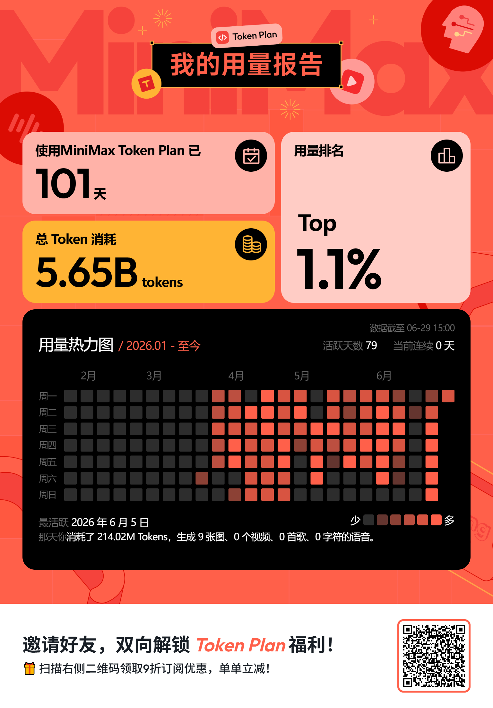

# SwitchAI - Claude / OpenAI API 聚合网关

一个本地多提供商 API 聚合网关服务，支持 Anthropic Claude 与 OpenAI 两种协议互通、模型路由、Token 统计、请求历史、配额监控、2FA 等功能，提供统一的本地端点给 VSCode Claude Code 或其他客户端使用。

## 功能特性

### 核心代理
- 🔄 **多提供商管理**：在 Web 界面集中配置多个上游 API（不同 BaseURL / API Key / 模型 / 协议）
- 🎯 **模型路由 / 映射**：为每个服务器密钥声明独立的 `user_model → provider_model` 映射表，支持 OpenAI 兼容的 `GET /v1/models` 网关
- 🔁 **格式自动转换**：Anthropic Claude 与 OpenAI Chat Completions 请求 / 响应双向自动转换，覆盖流式（SSE）与非流式
- 🛡️ **重试机制**：500 / 429 / 529 + `overloaded_error` / `rate_limit_error` / 含 `try again` / `high traffic` / `overloaded` / `负载较高` 的错误自动重试（最多 3 次，递增延迟）
- 🗜️ **解压透传**：自动处理 `gzip` / `deflate` / `zlib` / `br` 压缩响应

### 服务器密钥 & 限额
- 🔑 **多服务器密钥**：每个密钥拥有自己的备注、启用开关、限额
- 🚦 **四维限额**：每日请求次数、总请求次数、每日费用、总费用（任一超额返回 403）
- 🌐 **多端登录**：每个设备独立 session token，单端登出不影响其他设备

### 配额监控 (MiniMax Token Plan)
- 📊 **MiniMax 配额轮询**：每 10s 自动调用上游 `/v1/token_plan/remains`，拉取 5h 区间与 7d 本周两个窗口的用量
- 🎚️ **拦截开关**：每个 provider 可独立开关额度拦截，触发时返回 403 并附带 `window` / `used_percent` / `reset_in_sec`
- 🔁 **懒重置**：窗口 EndTime 过期后视为已重置，不再拦截

### 统计 & 历史
- 📈 **Token 统计**：实时累计输入 / 输出 / 总 Tokens + 费用
- 📉 **今日统计折线图**：每个密钥 5h / hour / 7d 多桶时间序列，多 Y 轴渲染（ECharts）
- 📜 **请求历史**：最近 1000 条记录入库 SQLite，毫秒级时间戳，详情查看 + JSON 格式化
- ⚡ **WebSocket 实时推送**：`/api/ws`（统计）、`/api/ws/history`（历史）、`/api/ws/config`（配置变更广播）三路推送

### 安全 & 运维
- 🔐 **2FA 登录**：首次访问生成 TOTP 二维码，绑定后每次登录输入 6 位验证码
- 🔁 **2FA Reset**：忘记密钥可用 `-reset` 命令清空并重新绑定
- 🚫 **内网模式**：`-skip` 参数跳过所有认证
- 🛠️ **服务安装**：Windows (`sc`) / Linux (systemd) 系统服务集成，配置文件与数据保留
- 📝 **日志轮转**：按日期时间自动轮转 info / error 日志

## 快速开始

### 一键安装

#### Windows (PowerShell)

```powershell
# 下载并安装为系统服务
irm https://github.com/kehuai007/switchai/releases/latest/download/switchai-windows-amd64.exe -OutFile switchai.exe; .\switchai.exe -install
```

#### Linux

```bash
# 下载并安装为系统服务
curl -L -o switchai https://github.com/kehuai007/switchai/releases/latest/download/switchai-linux-amd64 && chmod +x switchai && sudo ./switchai -install
```

---

## 界面


### 开发模式

```bash
# 安装依赖
go mod tidy

# 直接运行
go run main.go

# 指定端口运行
go run main.go -port 8080

# 跳过认证（内网部署）
go run main.go -skip
```

### 生产部署

```bash
# 构建所有平台版本
build.bat   # Windows
# 或
./build.sh  # Linux

# 输出文件在 dist/ 目录:
# - switchai-windows-amd64.exe (web资源已内嵌)
# - switchai-linux-amd64       (web资源已内嵌)
```

**注意**: Web 静态资源（含 ECharts）已通过 `go:embed` 打包进二进制文件，单文件部署，无需额外依赖。

## 命令行参数

```bash
# 默认端口(7777)启动，首次访问会显示 2FA 设置页面
switchai-windows-amd64.exe

# 指定端口启动
switchai-windows-amd64.exe -p 8080

# 安装为系统服务
switchai-windows-amd64.exe -install

# 安装为系统服务并指定端口
switchai-windows-amd64.exe -install -p 8080

# 卸载系统服务
switchai-windows-amd64.exe -uninstall

# 跳过认证模式（内网部署，无需密钥密码）
switchai-windows-amd64.exe -skip

# 重置 2FA（忘记密钥时使用，会清空所有 session）
switchai-windows-amd64.exe -reset
```

**首次启动**: 首次访问时，会显示 2FA 二维码，绑定 authenticator 应用后使用生成的 6 位验证码登录。若忘记密钥，使用 `-reset` 命令重置。

**内网部署**: 使用 `-skip` 参数启动时，全程不需要密钥密码即可使用。

## 服务安装

### Windows

服务安装路径: `C:\Program Files\SwitchAI`

```bash
# 安装服务 (需要管理员权限)
switchai-windows-amd64.exe -install

# 服务管理命令
sc start SwitchAI
sc stop SwitchAI
sc query SwitchAI

# 卸载服务 (保留数据文件)
switchai-windows-amd64.exe -uninstall
```

**注意**: 卸载服务时会保留配置文件、历史记录和日志文件，只删除二进制程序。

### Linux

服务安装路径: `/usr/local/bin`

```bash
# 安装服务 (需要 root 权限)
sudo ./switchai-linux-amd64 -install

# 服务管理命令
sudo systemctl start switchai
sudo systemctl stop switchai
sudo systemctl status switchai
sudo systemctl enable switchai  # 开机自启

# 卸载服务 (保留数据文件)
sudo ./switchai-linux-amd64 -uninstall
```

## Web 界面

访问地址: `http://localhost:7777`

### 页面说明

1. **首页** (`/`) - 提供商管理、模型映射、服务器密钥、配额卡片、密钥今日统计
2. **Token 统计** (`/log.html`) - 全局 Token / 费用使用统计
3. **请求历史** (`/history.html`) - 详细的请求 / 响应历史记录

### 首页关键功能

- **提供商卡片**：显示名称、BaseURL、激活开关、模型清单、测试连接、删除
- **模型映射**：每个服务器密钥下可声明 `user_model → provider_model` 映射（客户端用 `user_model` 调用，网关替换为 `provider_model` 转发）
- **配额卡片**：MiniMax 提供商自动展示 5h 区间 / 7d 本周两个横向进度条 + 重置时间，可启用「额度不足时拦截」开关
- **密钥今日统计**：点开每个密钥的「今日统计」按钮，按 5h / 1h / 7d 桶渲染请求数 / 花费 / 总 Tokens 折线图

### 请求历史功能

- **分页浏览**：最近 1000 条请求，每页 20 条
- **毫秒级时间戳**：精确到毫秒的时间显示 `2026-06-30 16:04:12.345`
- **详情查看**：点击 "View Details" 查看完整请求 / 响应（含 headers、body、token、费用、模型映射）
- **JSON 格式化**：一键格式化 JSON 请求 / 响应体

## 模型路由与 `/v1/models`

SwitchAI 在 `user_model` 与 `provider_model` 之间建立解耦：

- 客户端（Claude Code、Cursor、其他 OpenAI 客户端）通过 **服务器密钥** + **`user_model`** 调用网关
- 网关根据「该密钥下声明的映射」选择具体 provider，并把请求里的 `model` 字段替换为 **`provider_model`** 后转发
- 调用方无需感知上游实际模型名；映射缺失返回 403 / 500

`GET /v1/models` 返回该 Bearer key 可见的、目标 provider 处于 active 状态的映射目标列表，形状兼容 OpenAI：

```json
{
  "object": "list",
  "data": [
    { "id": "claude-sonnet-4-6", "object": "model", "created": 1719715200, "owned_by": "switchai" }
  ]
}
```

## 协议转换

| 客户端请求格式 | 上游 provider 格式 | 行为 |
| --- | --- | --- |
| Anthropic (`/v1/messages`) | Anthropic | 直接转发 |
| OpenAI (`/v1/chat/completions`) | OpenAI | 直接转发 |
| Anthropic | OpenAI | 请求 Claude→OpenAI，SSE 与非流式响应均转为 Claude 形态 |
| OpenAI | Anthropic | 请求 OpenAI→Anthropic，响应转为 OpenAI 形态 |

格式判断完全由 provider 的 `is_openai_format` 配置字段决定；上游是否暴露 `/v1/models` 由实际部署决定，不由客户端假设。

## 配额监控（MiniMax Token Plan）

针对 BaseURL 命中 `minimaxi.com` 或其子域的 active provider，后台每 10s 调用一次：

```
GET https://api.minimaxi.com/v1/token_plan/remains?model=general
Authorization: Bearer <provider.APIKey>
```

返回的 `interval`（约 5h 区间）与 `weekly`（约 7d 本周）窗口同时缓存到内存，包含 `used_percent` / `remaining_percent` / `reset_in_sec` / `reset_in_human` 等字段。

- **展示**：首页每个 provider 卡片显示两条横向进度条
- **拦截**：当用户为某 provider 开启「额度不足时拦截」且任一窗口 `used_percent ≥ 99%` 时，网关在请求转发前直接返回 403：

```json
{
  "error": "上游账户额度不足(区间窗口已用 99.5%)，将于 2h13m 后重置",
  "window": "interval",
  "used_percent": 99.5,
  "reset_in_sec": 7980
}
```

窗口 `end_time` 已过视为已重置，自动退出拦截状态。

## 数据存储

数据目录: `./.switchai/`（Windows 为 `%USERPROFILE%\.switchai\`）

| 文件 | 内容 |
| --- | --- |
| `config.db` (SQLite) | 提供商、服务器密钥、模型映射、2FA、会话、配额拦截开关 |
| `stats.db` (SQLite) | `usage_records`、`provider_stats`、`key_stats`、`key_daily_stats` |
| `history.db` (SQLite) | 请求 / 响应历史（最多 1000 条，自动清理） |
| `logs/` | 按日期时间轮转的 `info_*.log` / `error_*.log` |

## 配置 VSCode Claude Code

```json
"claudeCode.environmentVariables": [
    { "name": "ANTHROPIC_AUTH_TOKEN", "value": "sk-xxxxxxxxxxxxxxxx" },
    { "name": "ANTHROPIC_BASE_URL",    "value": "http://localhost:7777" },
    { "name": "ANTHROPIC_MODEL",       "value": "claude-sonnet-4-6" }
]
```

`ANTHROPIC_AUTH_TOKEN` 填 Web 界面「服务器密钥」页生成的 `sk-xxxx` 值（不是上游 provider 的 API Key）。`ANTHROPIC_MODEL` 必须与该密钥下某条映射的 `user_model` 一致。

## API 端点

> 除 `POST /api/login`、`POST /api/totp/*` 外，其余 `/api/*` 路由均要求登录（`-skip` 模式下跳过）；`/api/totp/status` 也无需登录。

### 认证

- `POST /api/login` - 使用 2FA 验证码登录
- `POST /api/logout` - 登出当前设备
- `POST /api/totp/setup` - 首次设置（生成密钥 + otpauth URL）
- `POST /api/totp/verify` - 绑定 2FA
- `GET  /api/totp/status` - 查询 2FA 启用状态

### 提供商管理

- `GET    /api/providers` - 列出所有 provider（API Key 字段为空）
- `POST   /api/providers` - 添加 provider
- `PUT    /api/providers/:id` - 更新 provider（API Key 为空则保留原值）
- `DELETE /api/providers/:id` - 删除（存在映射时返回 409）
- `POST   /api/providers/:id/activate` - 切换激活状态
- `POST   /api/providers/:id/test` - 用选定模型 + 格式测试连通
- `POST   /api/providers/fetch-models` - 用 `{base_url, api_key, is_openai_format}` 拉取 `/v1/models`
- `POST   /api/providers/:id/fetch-models` - 编辑弹窗中拉取（用已存 provider 凭证）
- `PUT    /api/providers/:id/quota-block-enabled` - 切换该 provider 的额度拦截开关

### 服务器密钥

- `GET    /api/server-keys` - 列出所有密钥
- `POST   /api/server-keys` - 添加（自动生成 `sk-` 值）
- `PUT    /api/server-keys/:id` - 更新（名称 / 限额 / 启用状态）
- `DELETE /api/server-keys/:id` - 删除
- `POST   /api/server-keys/generate` - 仅生成 `sk-` 字符串（不入库）
- `GET    /api/server-keys/:id/stats` - 累计统计 + IP 列表
- `GET    /api/server-keys/:id/today-stats?bucket=5h|hour|7d` - 桶状时间序列
- `POST   /api/server-keys/:id/test` - 真实走代理的端到端连通测试

### 模型映射

- `GET    /api/server-keys/:id/mappings` - 列出该 key 的全部映射
- `POST   /api/server-keys/:id/mappings` - 新增映射
- `PUT    /api/server-keys/:id/mappings/:mapping_id` - 更新
- `DELETE /api/server-keys/:id/mappings/:mapping_id` - 删除

### 统计 & 历史

- `GET    /api/stats` - 当前全局摘要
- `GET    /api/stats/daily` - 今日 + 历史每日摘要
- `POST   /api/stats/reset` - 重置所有统计
- `POST   /api/stats/reset/:provider_id` - 重置指定 provider 统计
- `GET    /api/history?page=1&page_size=20` - 分页历史
- `GET    /api/history/:id` - 单条历史详情

### WebSocket

- `GET /api/ws` - 实时统计推送
- `GET /api/ws/history` - 实时新增历史推送
- `GET /api/ws/config` - 配置变更广播（`provider_added`、`key_updated`、`mapping_deleted` 等事件，回声头 `X-Client-Token` 避免自更新循环）

### Claude / OpenAI API 代理

- `GET  /v1/models` - 返回该 Bearer key 可见的 active 映射目标
- `ANY  /v1/*` - 代理所有 chat / messages 请求，按请求格式 + 映射转发到目标 provider

## 项目结构

```
switchai/
├── main.go                  # 入口：CLI 解析、生命周期、路由注册
├── build.bat / build.sh     # 多平台构建脚本
├── go.mod / go.sum          # Go 依赖
├── providers.json           # 默认 provider 配置示例
├── appdata/                 # 数据目录初始化（.switchai）
├── config/                  # SQLite 配置层（Provider / ServerKey / ModelMapping / TOTP / Session / Quota）
├── quota/                   # MiniMax Token Plan 配额轮询 + 拦截决策
├── proxy/                   # /v1/* 代理 + 格式转换 + 重试 + 解压
├── stats/                   # Token / 费用 / 限额统计
├── history/                 # 请求 / 响应历史（SQLite + WebSocket 推送）
├── logger/                  # 日志轮转（info / error 双通道）
├── service/                 # Windows sc / Linux systemd 服务安装
├── update/                  # 自动更新骨架（暂未启用）
└── web/
    ├── web.go               # Web API（embed 静态资源）
    ├── ws_config.go         # 配置变更 WebSocket 广播
    └── static/
        ├── index.html       # 管理首页（含 ECharts 折线图）
        ├── log.html         # 全局统计
        └── vendor/
            └── echarts.min.js   # 本地内嵌的 ECharts 5
```

**特性**: 使用 `go:embed` 将 Web 静态资源（含 ECharts）打包进二进制，单文件部署。

## 依赖技术栈

| 组件 | 技术 |
| --- | --- |
| Web 框架 | Gin (`github.com/gin-gonic/gin`) |
| 数据库 | SQLite (`modernc.org/sqlite`) |
| WebSocket | `gorilla/websocket` |
| 2FA | `pquerna/otp` (TOTP) |
| UUID | `google/uuid` |
| 压缩 | `andybalholm/brotli`、`compress/gzip`、`compress/flate`、`compress/zlib` |
| 图表 | ECharts 5（本地 vendor） |
| CORS | `gin-contrib/cors` |

## 使用场景

1. **多账号 / 多上游管理**：在一个本地端点下管理多个 Claude / OpenAI 兼容上游，按需切换或映射不同模型
2. **协议互通**：用 OpenAI 客户端调 Anthropic Claude，或反之
3. **额度 / 成本控制**：为每个服务器密钥设置独立的请求次数与费用限额，订阅 MiniMax Token Plan 后可启用额度自动拦截
4. **请求审计**：所有请求 / 响应落库 SQLite，方便回溯
5. **内网代理**：用 `-skip` 模式在公司内网部署统一的 API 网关

## 系统要求

- Go 1.21 或更高版本（构建时）
- Windows 10+ 或 Linux（systemd）
- 服务安装需要管理员 / root 权限

## 注意事项

- 配置文件 `config.db` 包含敏感信息（API Key），请勿提交到版本控制
- 历史记录 `history.db` 可能包含敏感数据，注意保护
- 建议在本地网络环境下使用，不要暴露到公网
- Token 统计数据保存在 SQLite 中，重启服务后会保留
- 请求历史持久化到文件，重启后会自动加载

## 九点九折开通MiniMax

🚀 MiniMax Token Plan
订阅一份套餐，解锁最新模型 —— 前沿 Coding 能力、1M 超长上下文、原生多模态，图文音视频共用套餐额度。
🎁 邀友双赢福利
好友订阅享 9折 + Builder 权益，邀请人得 10% 返利 + 社区特权！
立即订阅：https://platform.minimaxi.com/subscribe/token-plan?code=nAAsoATPsf&source=link



## 请喝杯蜜雪冰城


MIT